# End-to-End Databricks Data Engineering Project — Digital Marketing Analytics

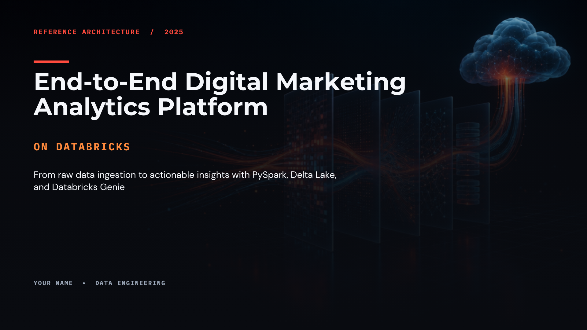

An end-to-end Data Engineering portfolio project built on **Databricks**, following the **Medallion Architecture** (Bronze → Silver → Gold), with a **Genie Agent** on top for natural-language Q&A over the data.

---

## 📌 Project Overview

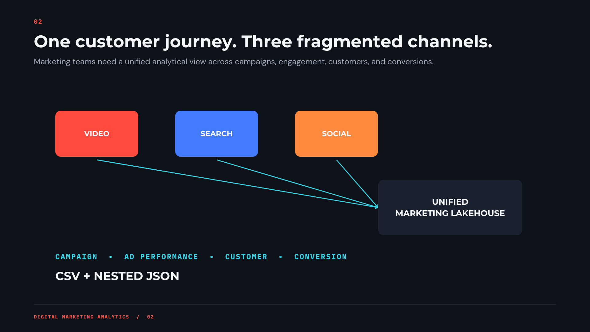

This project simulates a **Digital Marketing Analytics** platform — tracking ad campaigns, daily ad performance, customer conversions, and customer profiles — and builds a complete pipeline from raw files to business-ready aggregated tables, finished off with a Genie Agent that lets anyone ask questions in plain English.

**Why this project:** built as a portfolio/interview-ready showcase of core Data Engineering skills — ingestion, data modeling (star schema + SCD Type 1), aggregation design, and AI-powered self-serve analytics.

---

## 🏗️ Architecture

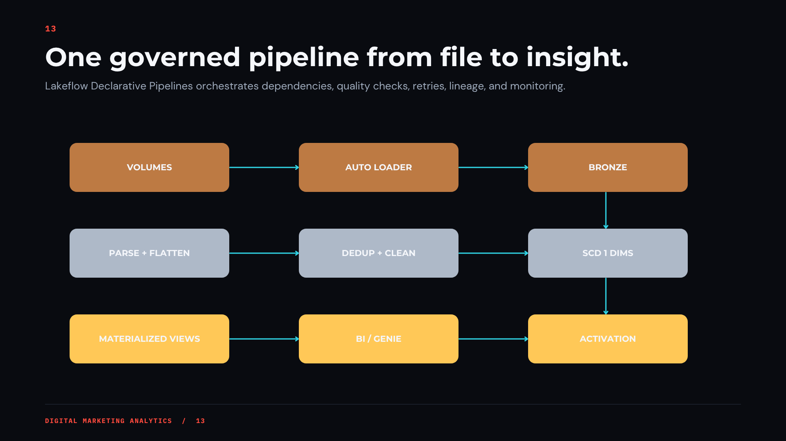
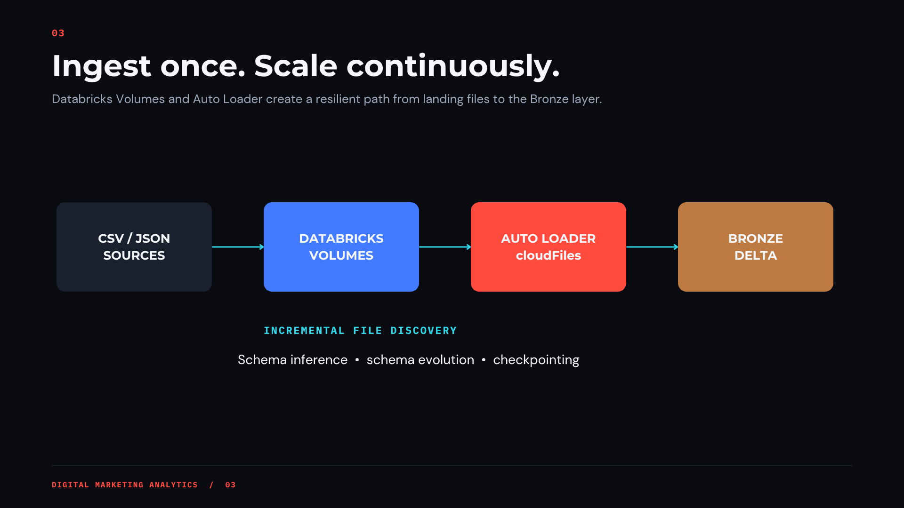

### Medallion Architecture Breakdown

#### Bronze Layer
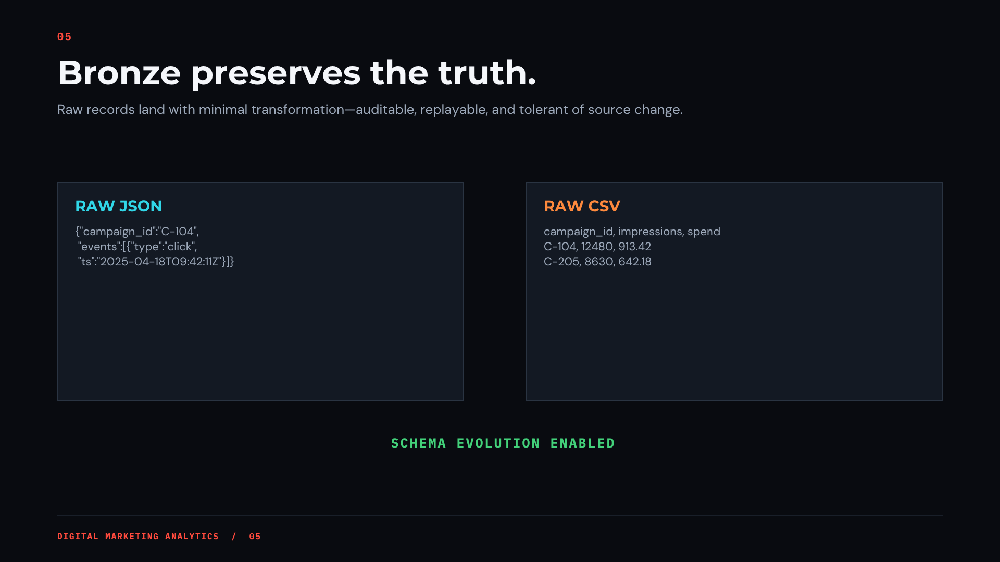

#### Silver Layer
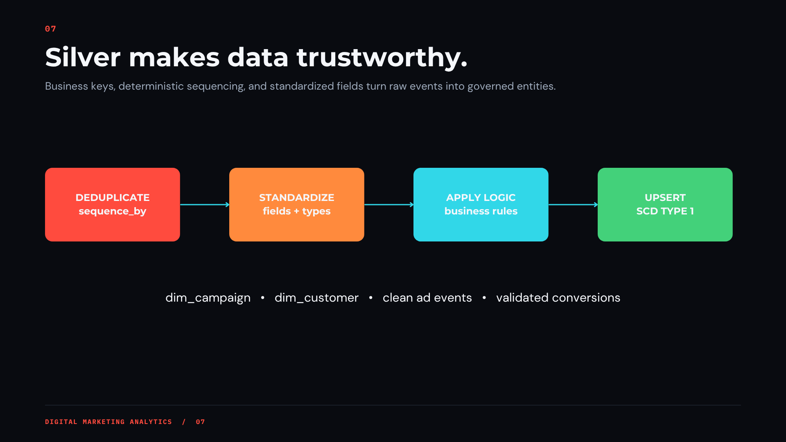
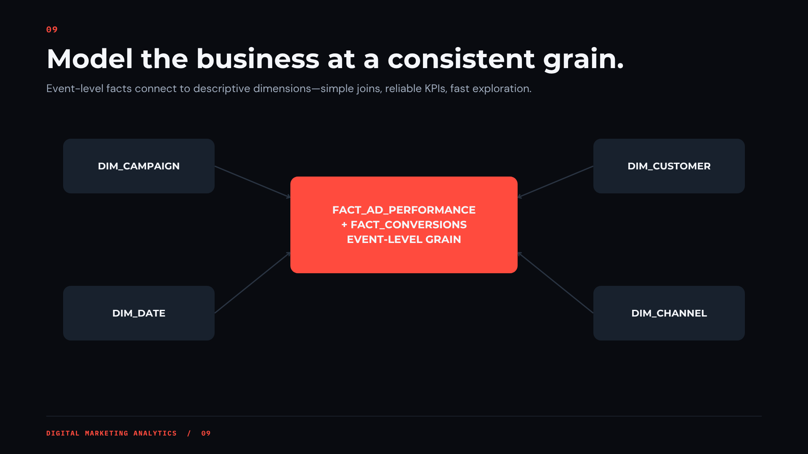
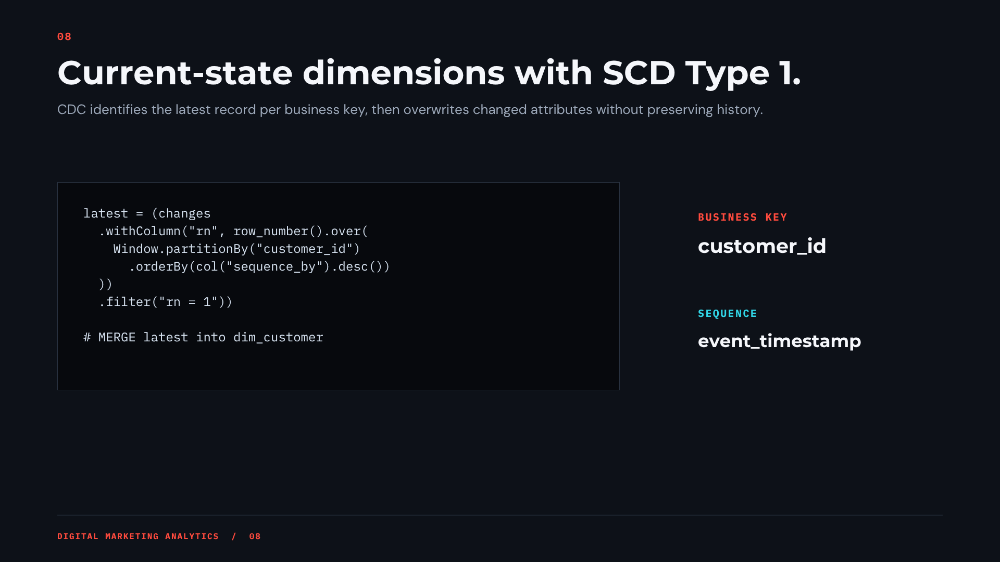

#### Gold Layer
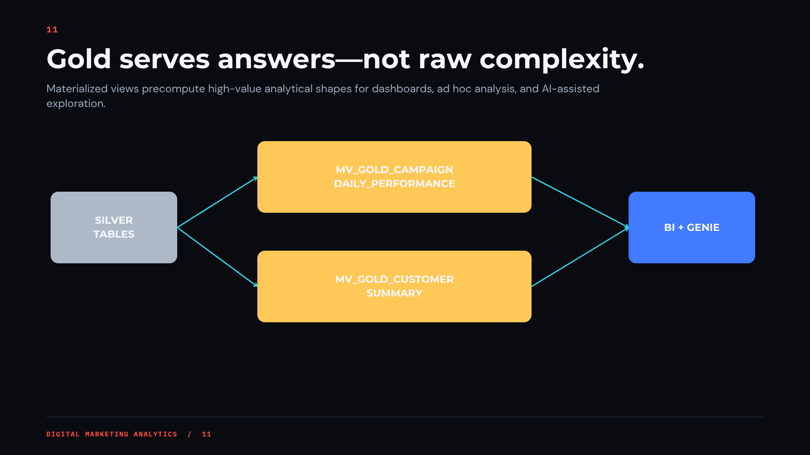
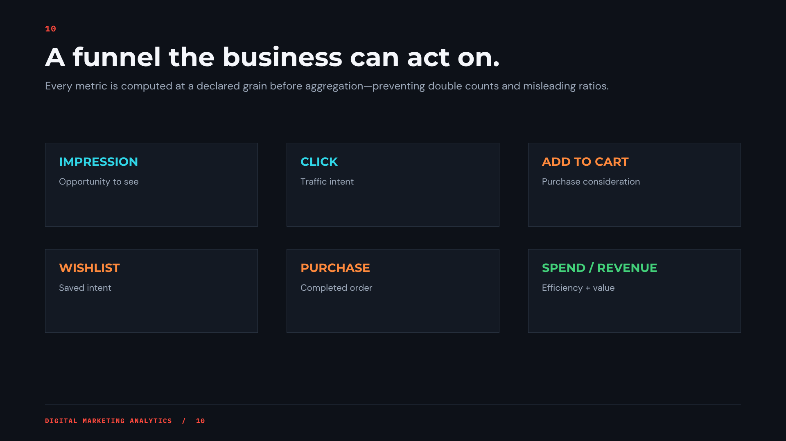
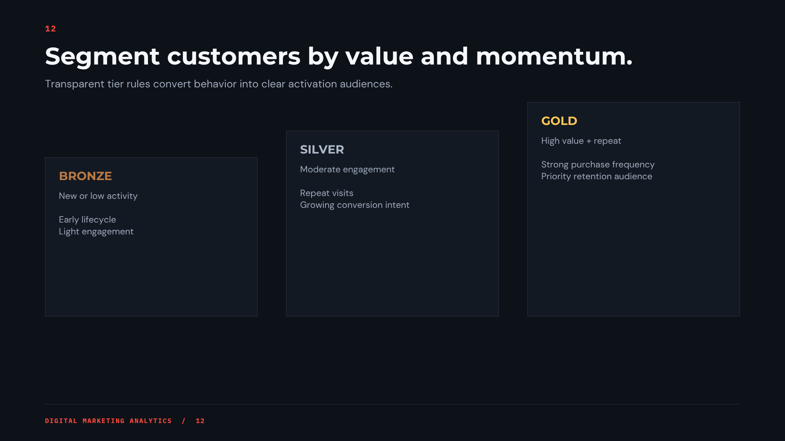

---

## 📂 Data Sources

Raw files land in Databricks **Volumes** before ingestion.

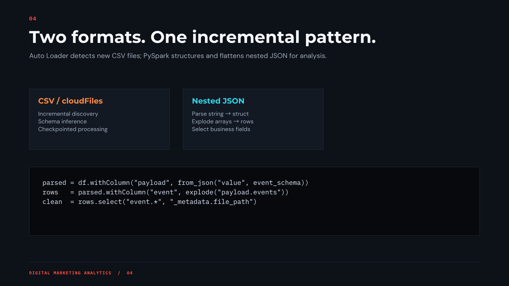
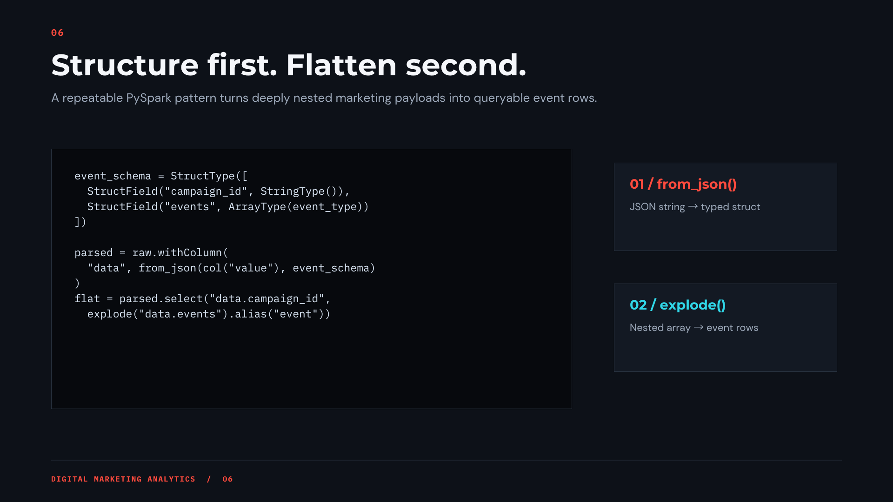

| File | Description |
|---|---|
| `campaign_master.csv` | Campaign reference data — `campaign_id`, `campaign_name`, `channel`, `start_date`, `budget_usd` |
| `ad_performance.csv` | Daily, per-campaign ad metrics — `campaign_id`, `date`, `impressions`, `clicks`, `spend_usd`, `device` |
| `conversions.json` | Nested conversion events per campaign/day — each record has a `conversion` array of `{customer_id, conversion_type, revenue_usd}` |
| `customer_profile.csv` | Customer dimension — `customer_id`, `signup_date`, `region`, `segment` |

Sample data: 5 campaigns, 25 customers, ~118 rows of ad performance, ~107 top-level conversion records spanning ~70 days.

---

## 🛠️ Tech Stack

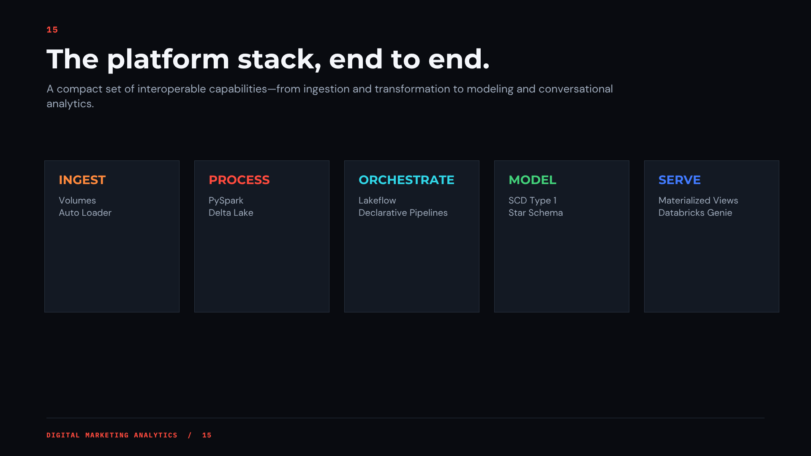

- **Platform:** Databricks (Unity Catalog, Auto Loader, Delta Lake, Genie)
- **Languages:** PySpark, SQL
- **Architecture pattern:** Medallion (Bronze → Silver → Gold)
- **Data modeling:** Star schema with Slowly Changing Dimensions (SCD Type 1)

---

## 🧞 Databricks Genie

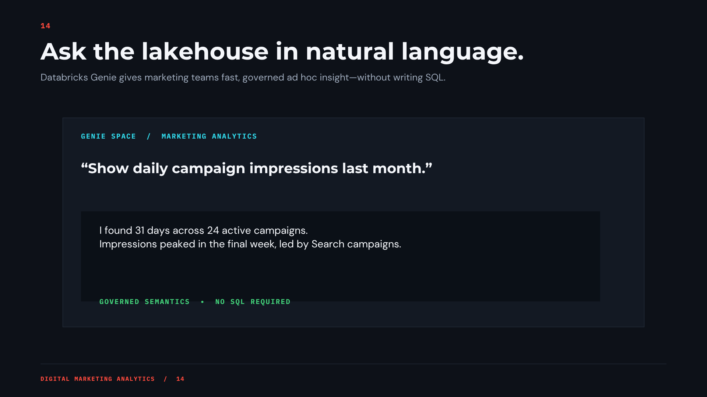

Natural language Q&A over the gold layer tables, enabling self-serve analytics.

---

## 🙋 About

Built by **Nisha**

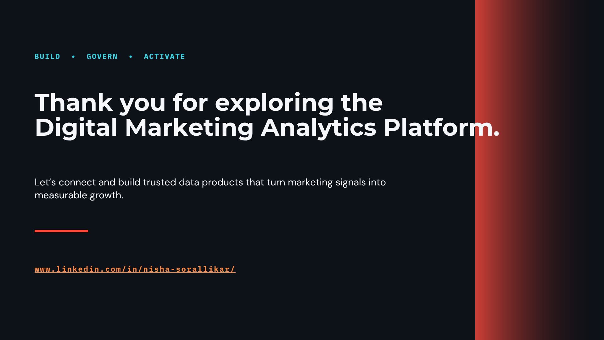
